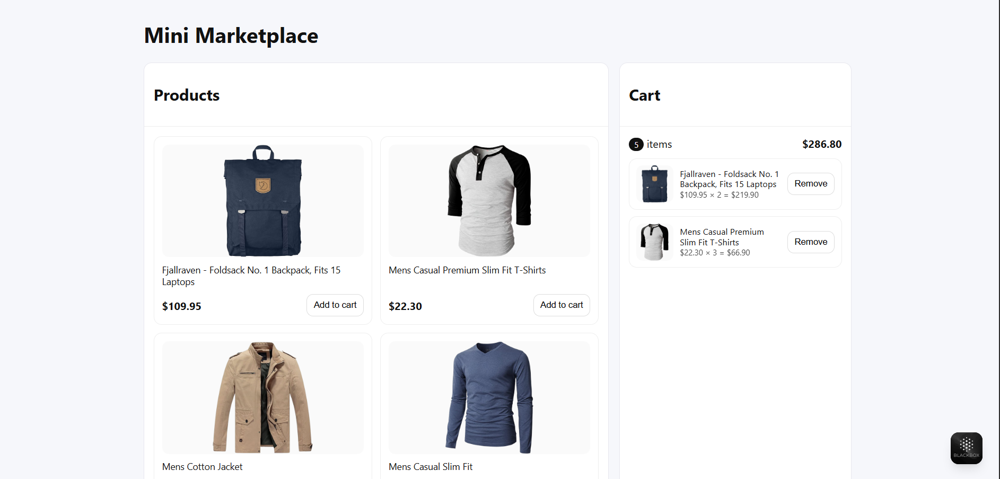
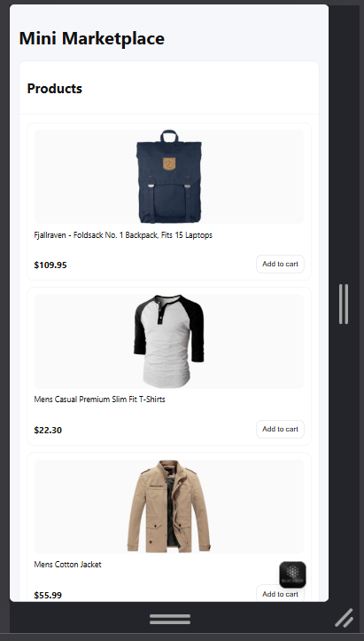

# Mini Marketplace

## Ism:

Izzatjon Qodirov

## Vazifa qancha vaqt oldi:

30 minut

## Qiyin bo‘lgan joylar:

- Vanilla JS (Products) va React (Cart) orasida integratsiya (CustomEvent)
- localStorage bilan saqlash (useEffect)

## Interfeys skrinshotlari:

- Desktop: 
- Mobile: 

## Demo havolasi (agar bo‘lsa):

- [(Netlify/Vercel link)](https://mini-marketplace-rambo.netlify.app/)

## Ishga tushirish

```bash
npm i
npm run dev
```
